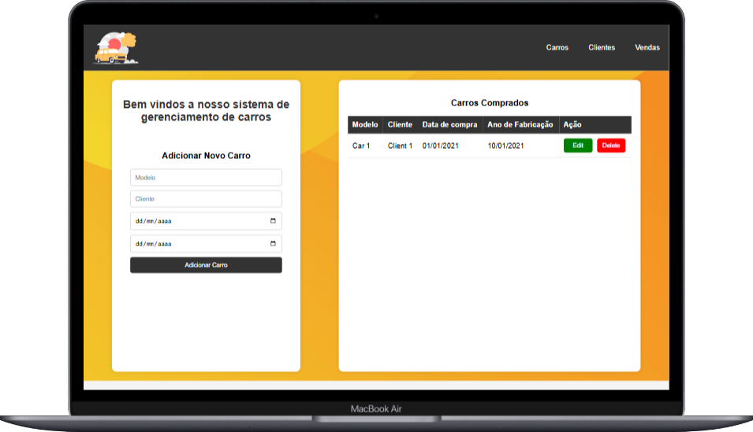

# 🚗 Sistema de Gerenciamento de Carros
Este é um sistema simples de gerenciamento de carros que permite adicionar, editar e remover carros de uma lista.

## 📄 Descrição dos Arquivos

- `index.html`: Arquivo HTML principal que contém a estrutura da página.
- `css/style.css`: Arquivo CSS que contém os estilos para a página.
- `js/script.js`: Arquivo JavaScript que contém a lógica para adicionar, editar e remover carros da lista.

## ⚙️ Funcionalidades

- ➕ Adicionar um novo carro preenchendo o formulário e clicando no botão "Adicionar Carro".
- ✏️ Editar um carro existente clicando no botão "Edit" ao lado do carro na tabela.
- 🗑️ Remover um carro existente clicando no botão "Delete" ao lado do carro na tabela.

## 🛠️ Como Usar

1. Clone o repositório para o seu ambiente local.
2. Abra o arquivo `index.html` em um navegador web.
3. Use o formulário para adicionar novos carros.
4. Use os botões "Edit" e "Delete" na tabela para editar ou remover carros.

## 💻 Tecnologias Utilizadas

- HTML
- CSS
- JavaScript

## Demonstração 🎥

Veja o projeto em ação na imagem abaixo:

